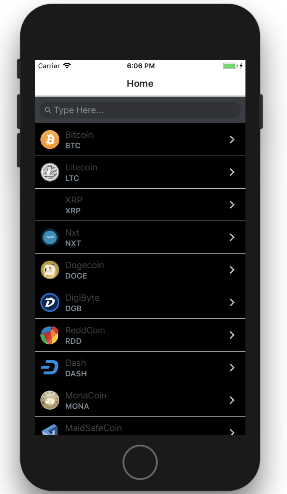
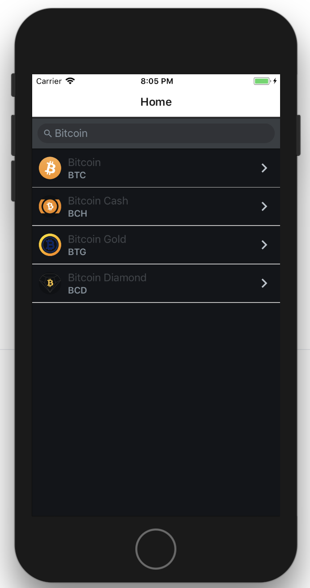
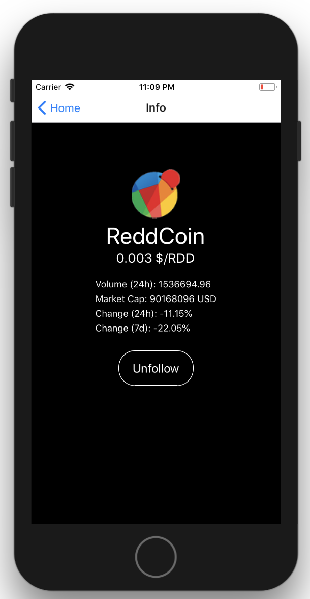

# Crypto App with react-native

### Using Public API from coinmarketcap to render a list of cryptocurrencies with its prices.


## Instruction to run
```bash
clone https://github.com/pinkbunny1/cryptoApp_react_native.git
cd crypto_react_native_app
npm install
react-native run-ios (For IOS)
react-native run-andriod (For Android)
```


## Trouble Shooting
- Bundling Error : `react-native start --reset-cache`


## Working Features
- Home Screen : Fetches and renders a list of cryptocurrencies from **API**
- Favourite Screen : Fetches and renders a list of cryptocurrencies from **AsyncStorage**
- Shake the phone to navigate to *Favourites* or *Home* screen
- Add/removes cryptocurrency to Favourite List using the AsyncStorage
- Search by the name of cryptocurrency


## Components
- CryptoList : Lists all cryptos from **API**
- FavCryptoList : Lists of all cryptos in Favourite List from **AsyncStorage**
- CryptoItem : Shows the detailed view of cryptocurrency such as *Prices*, *Price Changes*, add or remove from Favourite list


## App : Dark Themed
Home Screen


Search Feature


Detailed Screen



## To Do:
- [x] Finish HomeScreen (CryptoList View)
- [x] Add Navigation
- [x] Add Crypto Detailed Screen (CryptoItem View)
- [x] Add Shake Feature (CryptoList View)
- [x] Finish Crypto Detailed Screen (CryptoItem View)
- [x] Add Fav Button on Crypto Detailed Screen (CryptoItem View)
- [x] Add Favourite Crypto Screen (CryptoFav View)
- [x] Add Search on Favourite Crypto Screen (CryptoFav View)
- [x] Finish Favourite Crypto Screen (CryptoFavList View)
- [x] Finish search feature (CryptoList View)
- [x] Update FavList in state when unfollowed from FavListScreen (CryptoFav View)


## Contributors
- @pinkbunny1 (Jin Lee)
- @ramu3000 (Rasmus Laine)
- @MikaelTornwall (Mikael Törnwall)
